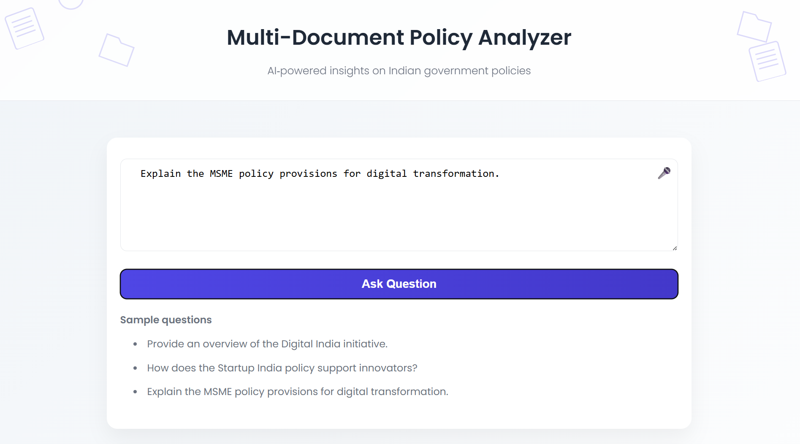

# Multi-Document Policy Analyzer

A production-oriented **Retrieval Augmented Generation (RAG)** system with a **FastAPI backend** designed to answer questions from large policy documents such as Digital India policies, NITI Aayog reports, MSME policies and startup policy frameworks.

Below is a preview of the web interface:<br>




Unlike traditional RAG demos that simply embed documents and retrieve chunks, this system implements several improvements focused on **retrieval quality, traceability and reliability**.

The system is built to simulate how industry-grade AI assistants retrieve knowledge from large document collections while **minimizing hallucinations and providing evidence-based answers**.

---

## Objective

The goal of this project is to build a reliable document intelligence system capable of answering complex questions from large policy reports.

The system focuses on :
- semantic understanding of policy documents
- evidence based responses grounded in source material
- retrieval optimization to reduce hallucination
- modular architecture for scalable AI systems

Instead of acting as a simple chatbot, the system behaves as a document intelligence engine capable of retrieving and reasoning over large structured knowledge bases.

---

## Key Features

### Document Intelligence Pipeline

The system processes complex policy documents and converts them into a searchable knowledge base.

Features include:

- automatic loading of multiple PDF documents  
- structured metadata extraction (source, page number, category)  
- document chunking optimized for semantic retrieval  

---

### Evidence Based Retrieval **(reduces LLM Hallucination)**

Each answer produced by the system includes references to the original source documents.

This ensures:

- answer traceability  
- improved trust in generated responses  
- reduced hallucination risk  

**Example output**

Answer:

Project Vaani focuses on building large-scale speech datasets for Indian languages.

Sources:

- digital_india_policy.pdf (page 18)
- ai_strategy_report.pdf (page 12)


---

### Similarity Score Filtering

Retrieval results are filtered using similarity thresholds to remove weakly related document chunks.

This improves context quality and reduces irrelevant information entering the LLM prompt.

---

### Metadata Enriched Documents

Every document chunk stores structured metadata including:

- source document name  
- page number  
- document category  
- document path  

This enables:

- accurate citation of sources  
- debugging retrieval results  
- document level filtering in future extensions  

---

### Modular Pipeline Architecture

The system is designed with modular components that separate responsibilities across the pipeline.

Core modules include:

- document loader  
- text splitter  
- embedding generator  
- vector database manager  
- LLM service layer  
- RAG pipeline orchestrator  

This design allows easy extension for:

- new models  
- different datasets  
- alternate retrieval strategies  

---

### Vector Database Persistence

The system avoids recomputing embeddings by persisting the vector database locally.

This ensures:

- faster startup times  
- reduced compute cost  
- scalable document indexing  

---

### Experimental Research Notebook

An experimentation notebook is included to explore:

- chunking strategies  
- embedding generation  
- similarity score behavior  
- retrieval quality  

This demonstrates the engineering process used to design the final pipeline.


## Project Structure
The system follows an industry-style modular structure.

```
rag_project
│
├── dataset/                        ## Policy documents used for knowledge retrieval
│   ├── ai_policies/
│   ├── digital_india_policies/
│   ├── msme_policies/
│   ├── niti_ayog_policies/
│   └── startup_policies/
│
├── notebooks/
│   └── experimentation.ipynb       ## Experiments with chunking, embeddings and retrieval
│
├── src/                            ## Core RAG pipeline modules
│   ├── embeddings.py               ## Embedding generation logic
│   ├── llm_service.py              ## LLM API interaction
│   ├── loader.py                   ## Document loading pipeline
│   ├── rag_pipeline.py             ## Main retrieval + generation pipeline
│   ├── splitter.py                 ## Document chunking logic
│   ├── vectorstore.py              ## Vector database management
│   └── vectorDB/                   ## Persistent Chroma vector database
│
├── ui/                             ## Front-end static files
│   ├── index.html                  ## Main interface
│   ├── style.css                   ## Stylesheet
│   └── assets/                     ## Decorative images & icons
│
├── main.py                         
├── requirements.txt                ## Project dependencies
└── README.md                       ## Project documentation
```

## Tech Stack
LLM Model : **"llama-3.3-70b-versatile"** (GROQ)

**Backend / Frameworks / Libraries**
- FastAPI (API server)
- LangChain
- ChromaDB (with PersistentClient)
- Uvicorn (ASGI server)

Embedding Model : **"sentence_transformers/all-MiniLM-L6-v2"** (HuggingFace Embeddings)

**Vector Search**
Cosine Similarity using HNSW indexing

**Other tools**
- Pydantic for request/response schemas
- Fetch API for UI communication

---

## Challenges Faced

### Choosing the Right Chunk Size
Large chunks reduce retrieval accuracy, while very small chunks break context.

**Solution**

Used **RecursiveCharacterTextSplitter** and experimented with chunk sizes inside the notebook to balance context and retrieval precision.

---

### Managing Embedding Storage
Recomputing embeddings on every run would make the pipeline inefficient.

**Solution**

Implemented **persistent vector storage with ChromaDB**, allowing embeddings to be stored once and reused.

---

### Preventing Hallucinated Responses
LLMs may generate confident but incorrect answers when context is missing.

**Solution**

Designed prompts that instruct the model to:

- answer strictly from retrieved context
- return **“I don't know” if the answer is not present**

---

### Maintaining Clean Architecture
Many RAG tutorials mix logic inside notebooks or single scripts.

**Solution**

Built the system with **modular components and clear separation of responsibilities**, making the codebase easier to extend and maintain.

---

## Optimizations Implemented

- Persistent vector database for faster retrieval
- Cosine similarity search for accurate semantic matching
- Chunking strategy that preserves semantic meaning
- Metadata tracking for document traceability
- Modular pipeline design for scalability

These improvements move the system closer to **real-world AI application design**.

---

## Running the Project

### Install dependencies

pip install -r requirements.txt

### Set environment variables

GROQ_API_KEY=your_api_key
HF_TOKEN=your_token

### Run the pipeline

uvicorn main:app --reload

## Future Improvements

Possible extensions for this project include :
- Hybrid search (keyword + vector search)
- Streaming responses
- Evaluation metrics for retrieval quality
- Web interface for user interaction
- Support for multiple embedding models

## Conclusion

This project demonstrates how to build a **structured, modular and reliable Retrieval Augmented Generation system.**

The focus is not only on making RAG work, but on designing it in a way that reflects production-ready AI engineering practices, including modular architecture, persistent storage and safeguards against hallucinations.


